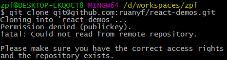
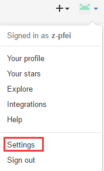

<h3>终于搭建成功了！</h3>
<!-- more -->
期间遇到了很多问题，先记录一个使用git bash时的问题：`生成SSH密钥`（避免每次操作时都要输入密码）

1.查看是否已经有了ssh密钥
```javascript
cd ~/.ssh
```
2.生成密钥（连续按回车三次，密码为空）
```javascript
$ ssh-keygen -t rsa -C "你的邮箱"
```
3.最终得到两个文件：`id_rsa`和`id_rsa.pub`

4.登录gitLab添加密钥，将`id_rsa.pub`中的内容复制到密钥处，添加成功。

*********************************************************************************

当克隆远程仓库时报如下错误：

解决方式：
1.到自己的github个人设置中

2.进入`SSH and GPG keys`中，点击`New SSH key`把上面提到的`id_rsa.pub`中的内容复制到密钥处，title为个人邮箱，添加成功。