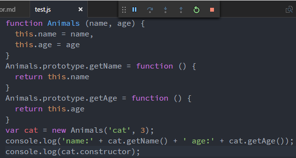
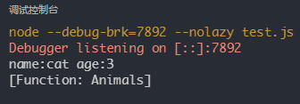
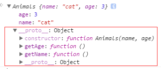
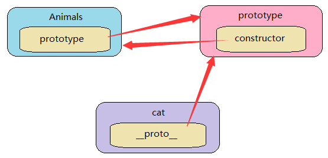
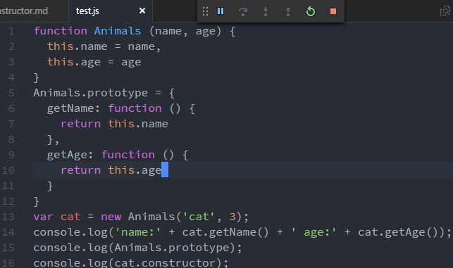
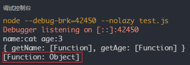
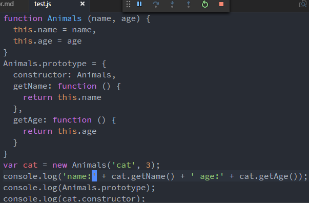
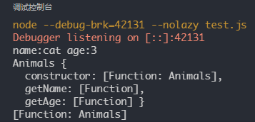

## 理解js的constructor

<!-- more -->

`constructor指向创建了该对象原型的构造函数`

提到constructor肯定要说prototype,prototype是一个对象，而constructor是一个函数。
话不多说，直接看栗子理解constructor



上面代码中，cat是animals的一个实例，创建该对象原型的函数是构造函数Animals，所以cat的constructor指向Animals
在控制台打印cat结果如下，这张图可以清楚的说明cat实例的原型指向`Animals.prototype`,创建该原型的函数就是Animals，所以cat的constructor指向Animals

由上图又可以得出构造函数、构造函数原型、实例、实例原型和实例constructor的指向关系

既然对象的constructor指向创建了该对象原型的函数，那创建该对象原型的函数变了constructor肯定也会发生变化，比如讲上面代码改成如下：


结果如下：

原因就是创建该对象原型的函数变了，这里的prototype相当于
```javascript
Animals.prototype = new Object({
  getName: function () {
    return this.name
  },
  getAge: function () {
    return this.age
  }
})
```
如果想要cat实例的constructor仍然指向Animals,可以定义prototype的constructor属性



这样就可以了。
***
## 总结
* 对象的constructor指向创建了该对象原型的构造函数
* 修改构造函数的prototype对象，生成实例的constructor也会发生变化