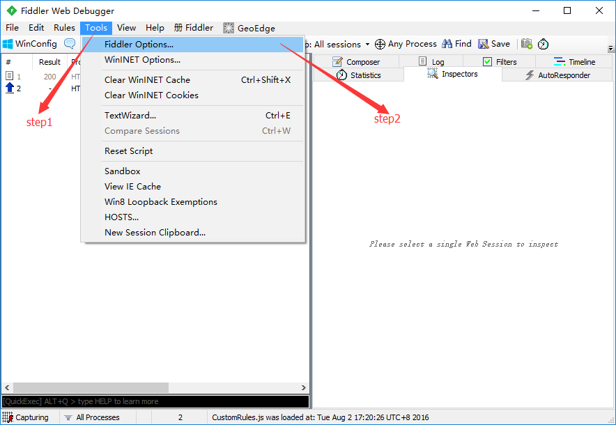
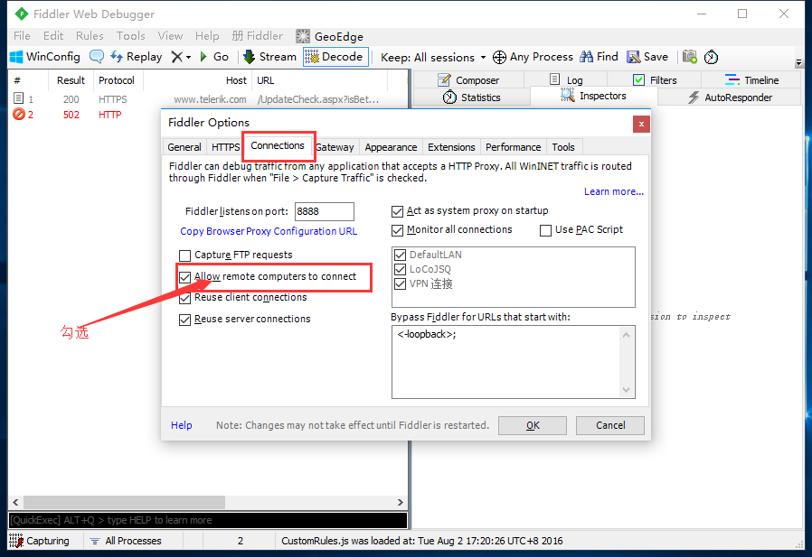

Fiddler

<!-- more -->

##### 初用fiddler遇到一个问题如下

手机加代理之后，ip和端口号都正确，也能连接到fiddler，但是手机上不了网，关掉代理，手机就可以上网，电脑防火墙也关了，都没用。

`解决办法`

在fiddler依次进行如下设置：

tools（工具）——> fiddler options（fiddler选项）——> connections（连接）——> 勾选allow remote computers to connect（允许远程电脑连接）

